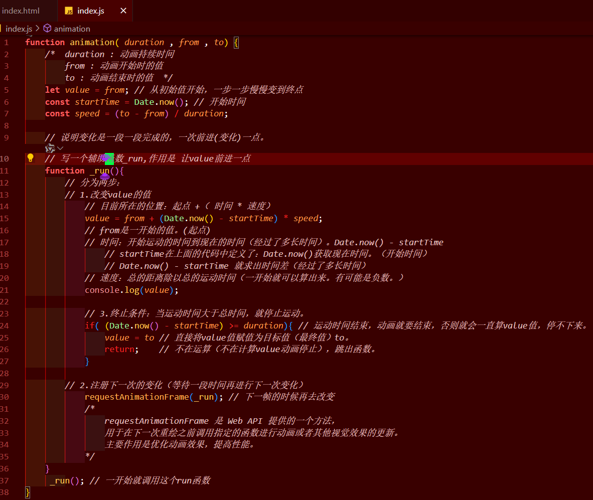

# 学习网址

- 渡一前端提薪课：封装动画函数
- https://www.douyin.com/video/7353564429838994740


------

# 目录

[TOC]

------


# 学习


```js
function _run(){
    // 改变value的值
    // 注册下一次的变化（等待一段时间再进行下一次变化）
    requestAnimationFrame(_run); // 下一帧的时候再去改变
    /*
            requestAnimationFrame 是 Web API 提供的一个方法，
            用于在下一次重绘之前调用指定的函数进行动画或者其他视觉效果的更新。
            主要作用是优化动画效果，提高性能。
    */ 
}
_run(); // 一开始就调用这个run函数
```


> `requestAnimationFrame` 是 Web API 提供的一个方法，用于在下一次重绘之前调用指定的函数进行动画或者其他视觉效果的更新。它的主要作用是优化动画效果，提高性能。
>
> 使用 `requestAnimationFrame` 的优势有以下几点：
>
> 1. **更高效的帧率控制**：`requestAnimationFrame` 会根据浏览器的刷新率自动调整帧率，使得动画更加平滑流畅。
> 2. **更好的性能**：当页面不可见或者最小化时，`requestAnimationFrame` 会暂停回调函数的执行，减少不必要的计算和渲染，节省系统资源。
> 3. **自动匹配设备刷新率**：`requestAnimationFrame` 会根据设备的刷新率自动调整动画的速度，使得在不同设备上的动画效果一致。
> 4. **简化代码逻辑**：使用 `requestAnimationFrame` 可以避免手动控制动画的帧率和时间间隔，简化代码逻辑。
>
> 在给定的代码中，`_run` 函数通过递归调用自身，并利用 `requestAnimationFrame` 来实现动画效果。每次调用 `_run` 函数时，它会修改 `value` 的值，并在下一次重绘之前注册下一次的变化，从而实现连续的动画效果。


## 基本效果实现

```html
<!DOCTYPE html>
<html lang="zh-cn">
<head>
    <meta charset="UTF-8">
    <meta name="viewport" content="width=device-width, initial-scale=1.0">
    <title>JS-打折数字动画效果-封装动画函数</title>
</head>
<body>
    
    <button class="btn">打折</button>
    <label for="">价格：4599.00</label>

    <script src="./index.js"></script>
    <script>
        // 拿到上面两个元素
        const label = document.querySelector('label'); // 价格,通过querySelector获取
        const btn = document.querySelector('.btn');    // 按钮,通过querySelector获取
        
        /*目标效果：页面上一个按钮，鼠标点击按钮，价格从一个数值变为另一个数值，通过动画效果实现；
            通过封装好的动画函数，告诉动画函数(传参)：动画的持续时间(2000==2s)、起始数字(4599.00)，结束数字(30)。
            传参之后，动画函数内部就会执行，就会把价格变为30，并且有动画效果；
        */
        /* 动画的本质是什么？动画的本质就是一个值(数字)的变化，在一段时间里面变成另外一个值。
            【css里面有些东西支持动画，有些东西不支持动画，只用看是不是数字，不是数字就不支持动画
            (长度、颜色、字体大小等是数字就支持，绝对定位相对定位不是数字就不支持)】       
       */
        // 给按钮绑定点击事件
        btn.onclick = function(){
            // 函数在index.js里面封装好了，直接调用，传参
            animation(2000, 4599, 30);
        }
    </script>
</body>
</html>
```

```js
function animation( duration , from , to) {
    /*
        duration : 动画持续时间
        from : 动画开始时的值
        to : 动画结束时的值
    */
    let value = from; // 从初始值开始，一步一步慢慢变到终点
    const startTime = Date.now(); // 开始时间
    const speed = (to - from) / duration;

    // 说明变化是一段一段完成的，一次前进(变化)一点。
    // 写一个辅助函数_run,作用是 让value前进一点
    function _run(){
        // 分为两步：
        // 1.改变value的值
            // 目前所在的位置：起点 +（ 时间 * 速度）            
            value = from + (Date.now() - startTime) * speed;
            // from是一开始的值。(起点)
            // 时间：开始运动的时间到现在的时间（经过了多长时间）。Date.now() - startTime
                // startTime在上面的代码中定义了：Date.now()获取现在时间。（开始时间）
                // Date.now() - startTime 就求出时间差（经过了多长时间）
            // 速度：总的距离除以总的运动时间（一开始就可以算出来。有可能是负数。）
            console.log(value);

            // 3.终止条件：当运动时间大于总时间，就停止运动。
            if( (Date.now() - startTime) >= duration){ // 运动时间结束，动画就要结束，否则就会一直算value值，停不下来。
                value = to // 直接将value值赋值为目标值（最终值）to。
                return;    // 不在运算（不在计算value动画停止），跳出函数。
            }

        // 2.注册下一次的变化（等待一段时间再进行下一次变化）
            requestAnimationFrame(_run); // 下一帧的时候再去改变
            /*
                requestAnimationFrame 是 Web API 提供的一个方法，
                用于在下一次重绘之前调用指定的函数进行动画或者其他视觉效果的更新。
                主要作用是优化动画效果，提高性能。
            */
    }
     _run(); // 一开始就调用这个run函数
}
```




### 实现效果


### 发现小问题


**可以看到最后输出的其实是23，但是因为运动的时间大于总时间（2s）了，所以执行了`if语句`，将value值直接赋值为30。**


```js
            value = from + (Date.now() - startTime) * speed;

            console.log(value);

            // 3.终止条件：当运动时间大于总时间，就停止运动。
            if( (Date.now() - startTime) >= duration){ // 运动时间结束，动画就要结束，否则就会一直算value值，停不下来。
                value = to // 直接将value值赋值为目标值（最终值）to。
                console.log(value);
                return;    // 不在运算（不在计算value动画停止），跳出函数。
            }

```


## 最终效果

最终效果：每一次变化的时候不要打印出来在控制台中，而是显示在label标签中。

### 方法一

```js
// 方法一：
// 只能限定在这个有label的环境里面。（必须有一个label，里面必须要显示的是一个价格）被限制了。
document.querySelector('label').textContent = value;
```


### 方法二

```js
// 方法二：（作为一个通用函数）【传入自己决定执行的操作函数】
// 函数参数的本质是啥?做这事情所缺失的条件。
// 根据用户传入的函数来决定要执行的操作，并把value值传入到函数中。
```


原本传入三个参数：

```js
btn.onclick = function(){
    // 函数在index.js里面封装好了，直接调用，传参
    animation(2000, 4599, 30);
}
```


现在传入4个参数：

```js
btn.onclick = function(){
    // 函数在index.js里面封装好了，直接调用，传参
    animation(2000, 4599, 30 , val=>{
        label.textContent = '价格：'+val.toFixed(2)+'元';
    });
}
```


以两位小数显示:

```js
val.toFixed(2)
```


### 实现效果


### 完整代码

```html
<!DOCTYPE html>
<html lang="zh-cn">
<head>
    <meta charset="UTF-8">
    <meta name="viewport" content="width=device-width, initial-scale=1.0">
    <title>JS-打折数字动画效果-封装动画函数</title>
</head>
<body>
    
    <button class="btn">打折</button>
    <label for="">价格：4599.00元</label>

    <script src="./index.js"></script>
    <script>
        // 拿到上面两个元素
        const label = document.querySelector('label'); // 价格,通过querySelector获取
        const btn = document.querySelector('.btn');    // 按钮,通过querySelector获取
        
        /*目标效果：页面上一个按钮，鼠标点击按钮，价格从一个数值变为另一个数值，通过动画效果实现；
            通过封装好的动画函数，告诉动画函数(传参)：动画的持续时间(2000==2s)、起始数字(4599.00)，结束数字(30)。
            传参之后，动画函数内部就会执行，就会把价格变为30，并且有动画效果；
        */
        /* 动画的本质是什么？动画的本质就是一个值(数字)的变化，在一段时间里面变成另外一个值。
            【css里面有些东西支持动画，有些东西不支持动画，只用看是不是数字，不是数字就不支持动画
            (长度、颜色、字体大小等是数字就支持，绝对定位相对定位不是数字就不支持)】       
       */
        // 给按钮绑定点击事件
        btn.onclick = function(){
            // 函数在index.js里面封装好了，直接调用，传参
            animation(2000, 4599, 30 , val=>{
                label.textContent = '价格：'+val.toFixed(2)+'元';
            });
        }
    </script>
</body>
</html>
```

```js
function animation( duration , from , to , onProgress) {
    /*  duration : 动画持续时间
        from : 动画开始时的值
        to : 动画结束时的值  */
    let value = from; // 从初始值开始，一步一步慢慢变到终点
    const startTime = Date.now(); // 开始时间
    const speed = (to - from) / duration;

    // 说明变化是一段一段完成的，一次前进(变化)一点。
    // 写一个辅助函数_run,作用是 让value前进一点
    function _run(){
        // 3.终止条件：当运动时间大于总时间，就停止运动。
        if( (Date.now() - startTime) >= duration){ // 运动时间结束，动画就要结束，否则就会一直算value值，停不下来。
            value = to // 直接将value值赋值为目标值（最终值）to。
            // console.log(value);

            // 方法一：（不通用）【直接dom查找然后赋值】
            // 只能限定在这个有label的环境里面。（必须有一个label，里面必须要显示的是一个价格）被限制了。
            // document.querySelector('label').textContent = value;

            // 方法二：（作为一个通用函数）【传入自己决定执行的操作函数】
            // 函数参数的本质是啥?做这事情所缺失的条件。
            // 根据用户传入的函数来决定要执行的操作，并把value值传入到函数中。
            onProgress(value);

            return;    // 不在运算（不在计算value动画停止），跳出函数。
        }

        // 分为两步：
        // 1.改变value的值
            // 目前所在的位置：起点 +（ 时间 * 速度）            
            value = from + (Date.now() - startTime) * speed;
            // from是一开始的值。(起点)
            // 时间：开始运动的时间到现在的时间（经过了多长时间）。Date.now() - startTime
                // startTime在上面的代码中定义了：Date.now()获取现在时间。（开始时间）
                // Date.now() - startTime 就求出时间差（经过了多长时间）
            // 速度：总的距离除以总的运动时间（一开始就可以算出来。有可能是负数。）
            // console.log(value);

        onProgress(value); // 计算完value值后，将其传入函数onProgress中，由用户决定实现的效果是什么。（动画效果-过程）

        // 2.注册下一次的变化（等待一段时间再进行下一次变化）
        	// 这是递归调用
            requestAnimationFrame(_run); // 下一帧的时候再去改变
            /*
                requestAnimationFrame 是 Web API 提供的一个方法，
                用于在下一次重绘之前调用指定的函数进行动画或者其他视觉效果的更新。
                主要作用是优化动画效果，提高性能。
            */
    }
     _run(); // 一开始就调用这个run函数
}
```